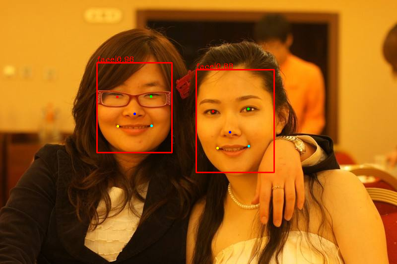
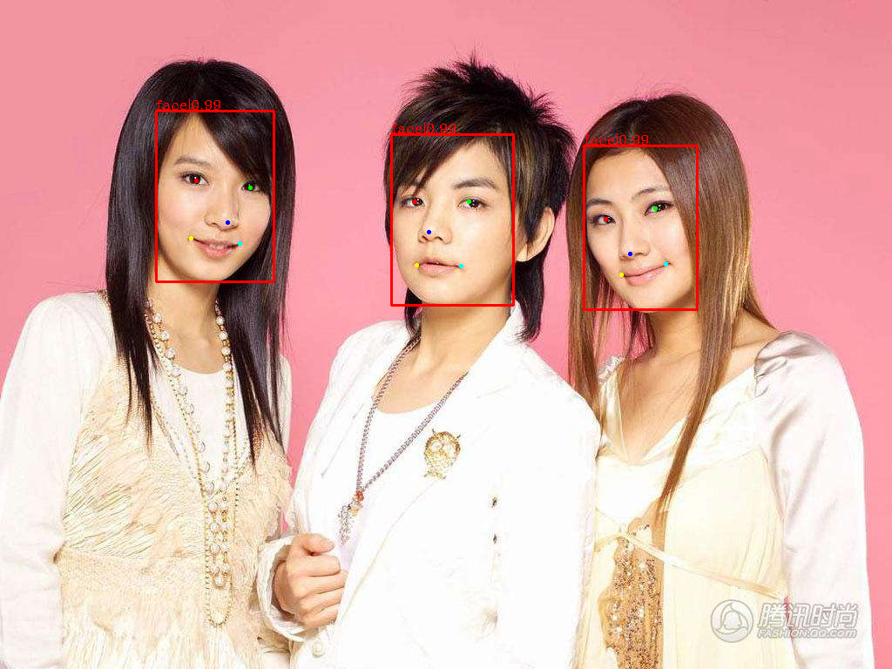
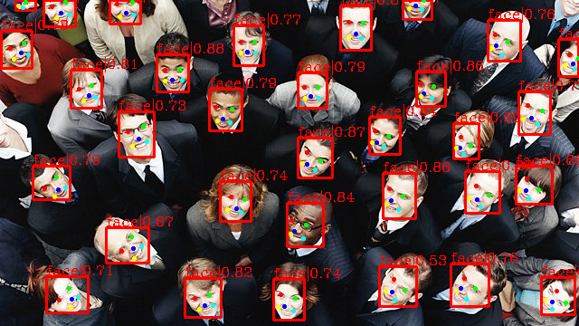
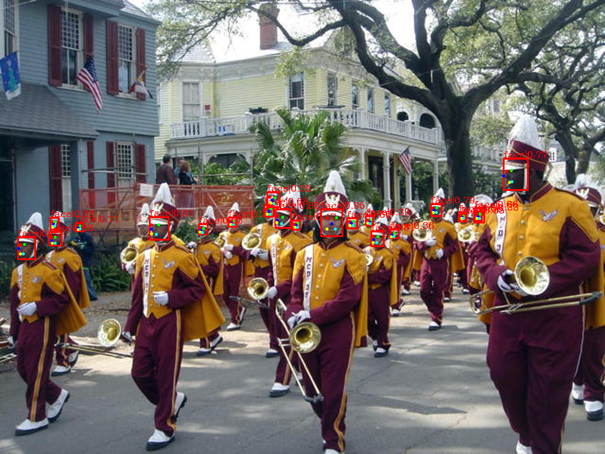

# Retinaface-on-mmdetection
Reimplement Retinaface on mmdetection.

# Changed files are listed as follows:

apis
- inference.py

anchor
- anchor_target.py

bbox
- base_sampler.py
- pseudo_sampler.py
- sampling_result.py
- assign_sampling.py
- transforms.py

post_processing
- bbox_nms.py

datasets
- formating.py
- loading.py

- transforms.py
- custom.py
- transforms.py
- wider_face.py
- xml_style.py

models
- anchor_head.py
- retina_head.py

detectors
- single_stage.py
- nms_wrapper.py

# Reimplement Result:

